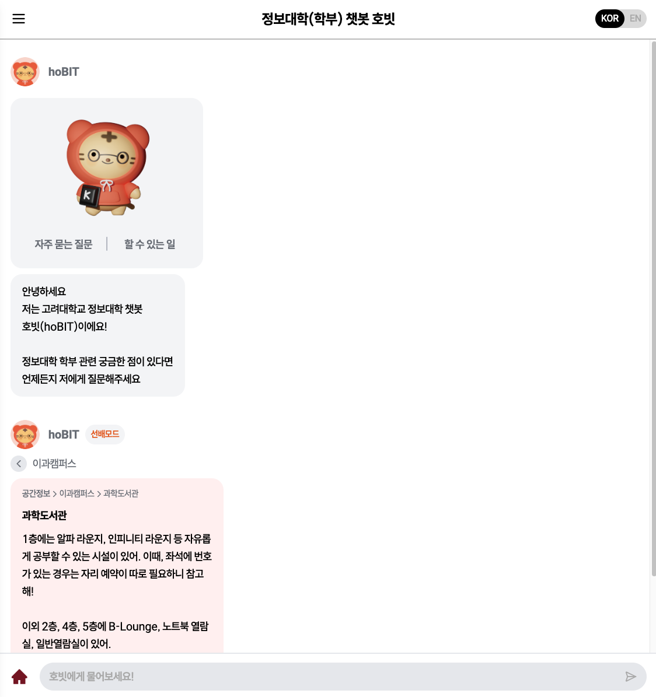
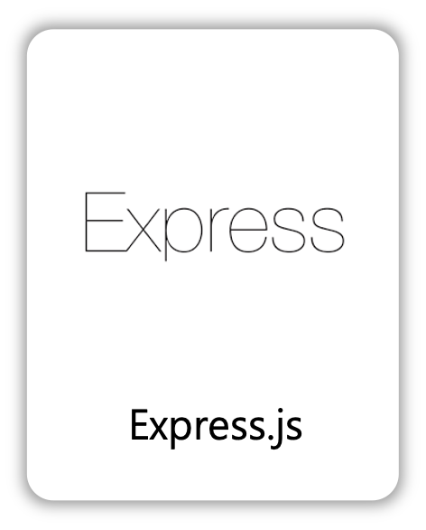
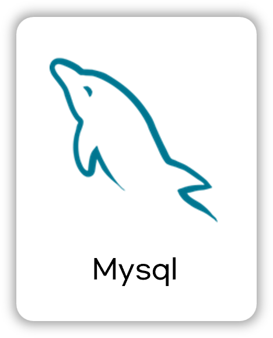
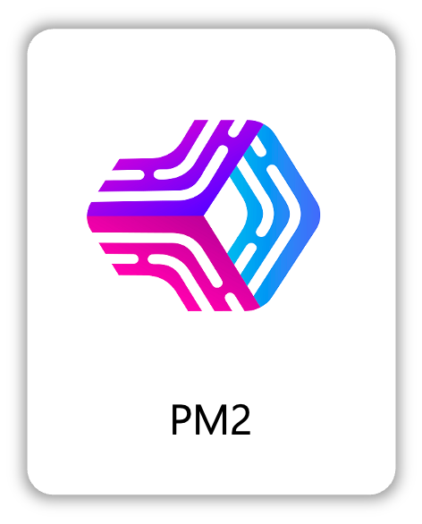

### hoBIT Backend

  

## 📝 소개

**hoBIT**은 정보대학 챗봇입니다.

**(ho**: 호랑이, **BIT**: 정보의 최소 단위)

정보대학 행정 관련 질문, 정보대학 선배들의 조언들을 한 곳에 모아두었습니다.

 

### 프로토타입

 

## 🗂️ APIs

작성한 API는 아래에서 확인할 수 있습니다.

👉🏻 [API 바로보기](https://magnificent-screw-658.notion.site/19ed8b1360b881f79b3ed11f1b8d4cf4)

 

## ⚙ 기술 스택

> skills 폴더에 있는 아이콘을 이용할 수 있습니다.

### Back-end

### Infra

### Tools

 

## 🛠️ 프로젝트 아키텍쳐

 

## 디비 스키마

[DB 스키마](https://magnificent-screw-658.notion.site/DB-1b8d8b1360b880d29577f87ad0ef37eb)

 

## 🤔 기술적 이슈와 해결 과정

### DB Deadlock 및 커넥션 누수 문제

- EC2와 PM2에서 문제 없이 작동했으나, 특정 시점부터 모든 API 요청이 무한 대기 상태에 빠짐.
- 서버 및 인프라 로그에서는 별다른 오류가 발견되지 않음.
- API를 수동으로 호출해본 결과, 특정 API를 약 10회 호출 시 이후 요청이 모두 응답 없이 대기하는 현상 발생.
- 해당 API 내부의 특정 분기에서 DB 커넥션을 반환하지 않고 있었던 문제를 발견.
- 커넥션이 반환되지 않아 커넥션 풀이 고갈되었고, 이에 따라 Deadlock이 발생.
- 문제 지점에 커넥션 해제 코드를 추가하여 커넥션 누수를 해결.
- 전역적으로 try-catch-finally 구문을 적용해 모든 커넥션이 정상적으로 반환되도록 코드 패턴 개선.

 

## 🔐 ENV 변수

`hobit` 에 사용되는 환경변수:

| 변수명               | 설명                      |
| -------------------- | ------------------------- |
| `TIMEZONE`           | 서버의 기본 시간대        |
| `DB_HOST`            | 데이터베이스 호스트 주소  |
| `DB_USER`            | 데이터베이스 사용자명     |
| `DB_PASSWORD`        | 데이터베이스 비밀번호     |
| `DB_NAME`            | 데이터베이스 이름         |
| `JWT_SECRET`         | JWT 토큰 서명 키          |
| `JWT_EXPIRATION`     | JWT 액세스 토큰 만료 시간 |
| `HOBIT_NLU_ENDPOINT` | RASA 서버 엔드포인트      |
